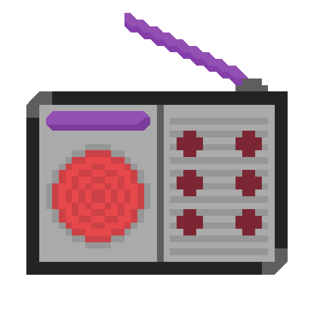
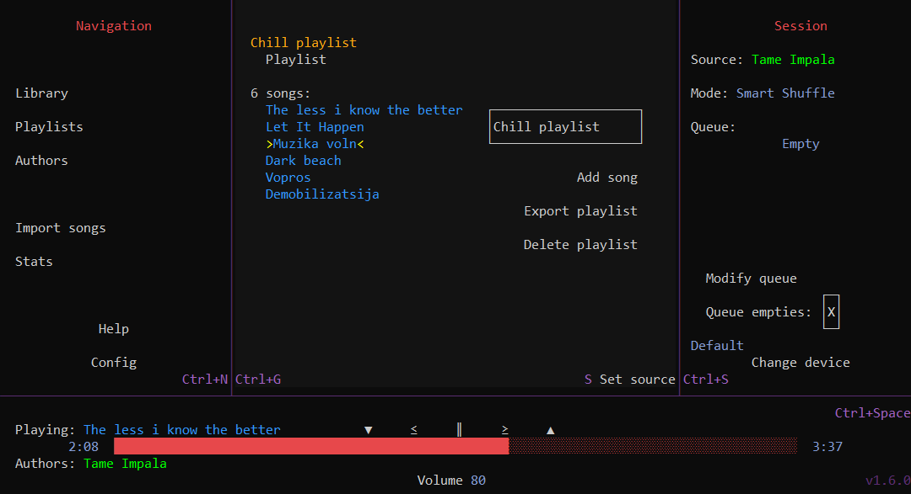

# AshRadio

AshRadio is a lightweight music player that runs in the terminal

## Features
- Fully terminal-based
- Lightweight and fast
- Importing songs/playlists from youtube with [yt-dlp](https://github.com/yt-dlp/yt-dlp)
- Exporting songs
- Wrapped-style stats
- OS media integration
- Customizable color palette
- Customizable keybinds

## Usage
You can import **songs** either from files natively or, using [yt-dlp](https://github.com/yt-dlp/yt-dlp), from youtube(or other supported sites).  
Songs can have multiple authors and be grouped in playlists. Albums do not exist for simplicity, but playlists can easily do the job.  
The session panel contains the queue for customizing the songs playing and the source, a 'pool' of songs to choose next from.  
There is a very complete in-app Help menu.  

**The application will only work in an interactive console**  

## Installation
You can install AshRadio for Windows, Linux and MacOS with the portable executable from the [releases](https://github.com/siljamdev/AshRadio/releases/latest).  
Compatibility with MacOS is **untested**.

## CLI
This application features a useful CLI for basic automatable actions, and has easy to parse output.  
To see more about it, do `ashradio -h`

## Configuration
The config file is located in `%appdata%/ashproject/ashradio/config.ash` or `~/.config/ashproject/ashradio/config.ash`.  
It is an **AshFile**, modifiable with [AshFile-Editor](https://github.com/siljamdev/AshFile-Editor).

### Palette
Colors are made up of foreground(fg) and background(bg), being Color3 structures. If they are left empty, default panel or default terminal colors will be used  
Their key in the ashfile is: `ui.palette.name`  
There are 4 ways of configuring them (`[]` meaning an array of Color3):
- Both fg and bg: `ui.palette.name: [fg, bg]`
- Only fg: `ui.palette.name: fg`
- Only bg: `ui.palette.name: [bg]`
- None: `ui.palette.name: []`

### Keybinds
Keybinds can have two keys associated to them, primary and secondary.  
Each key is represented by two integers, the first one representing a [ConsoleKey](https://learn.microsoft.com/en-us/dotnet/api/system.consolekey?view=net-10.0)(ck) and the second one a [ConsoleModifiers](https://learn.microsoft.com/en-us/dotnet/api/system.consolemodifiers?view=net-10.0)(cm).  
Their key in the ashfile is: `keybinds.name`  
There are 2 ways of configuring them (`[]` meaning an array of integers):
- Only primary: `keybinds.name: [ck1, cm1]`
- Both primary and secondary: `keybinds.name: [ck1, cm1, ck2, cm2]`

## License
This software is licensed under the [MIT License](./LICENSE).

## Internal operation
It is powered by [AshConsoleGraphics](https://github.com/siljamdev/AshConsoleGraphics). This library, made by myself, allows to easily make console applications as rich as this one.  
It also uses [Managed BASS](https://github.com/ManagedBass/ManagedBass) library for audio.